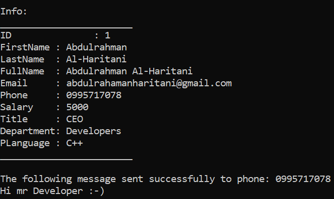

# Developer.cpp

A simple C++ project demonstrating **Multilevel Inheritance** in OOP
(`clsPerson` → `clsEmployee` → `clsDeveloper`).

📄 **Source Code**: [Developer/Developer.cpp](Developer/Developer.cpp)

## Class Hierarchy
clsPerson
↑
clsEmployee
↑
clsDeveloper


## Class Overview

### clsPerson (Base Class)

| Property   | Access         |
|------------|----------------|
| ID         | Read Only      |
| FirstName  | Read and Write |
| LastName   | Read and Write |
| FullName   | Read Only      |
| Email      | Read and Write |
| Phone      | Read and Write |

### clsEmployee (Derived from clsPerson)

| Property    | Access         |
|-------------|----------------|
| Salary      | Read and Write |
| Title       | Read and Write |
| Department  | Read and Write |

### clsDeveloper (Derived from clsEmployee)

| Property             | Access         |
|----------------------|----------------|
| ProgrammingLanguage  | Read and Write |

## Methods

### clsPerson
- `GetID()`
- `GetFirstName()` / `SetFirstName()`
- `GetLastName()` / `SetLastName()`
- `GetEmail()` / `SetEmail()`
- `GetPhone()` / `SetPhone()`
- `FullName()`
- `Print()`
- `SendEmail(Subject, Body)`
- `SendSMS(Message)`

### clsEmployee
- `GetSalary()` / `SetSalary()`
- `GetTitle()` / `SetTitle()`
- `GetDepartment()` / `SetDepartment()`
- `Print()`

### clsDeveloper
- `GetProgrammingLanguage()` / `SetProgrammingLanguage()`
- `Print()`

## Rule

Objects can only be created using the **Constructor**, because all properties are `private`.

## Example Usage

```cpp
clsDeveloper Developer1(1, "Abdulrahman", "Al-Haritani",
    "abdulrahamanharitani@gmail.com", "0995717078",
    5000, "CEO", "Developers", "C++");

Developer1.Print();
Developer1.SendSMS("Hi mr Developer :-)");
```

## Output



## Requirements

Visual Studio 2022 or any C++ compiler supporting C++11 or later.

## Author

Abdulrahman Al-Haritani
